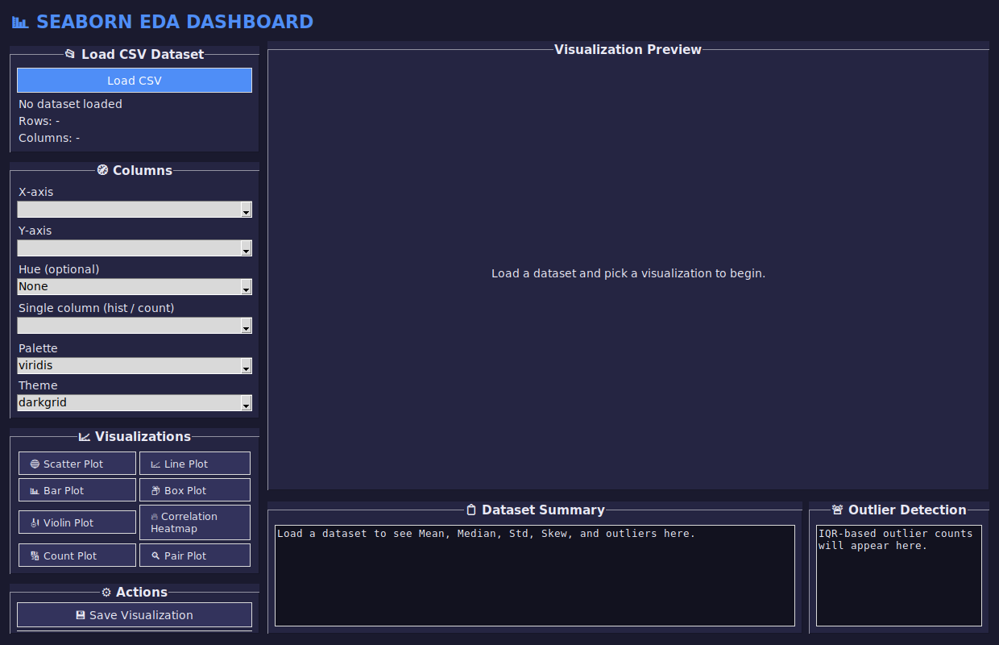
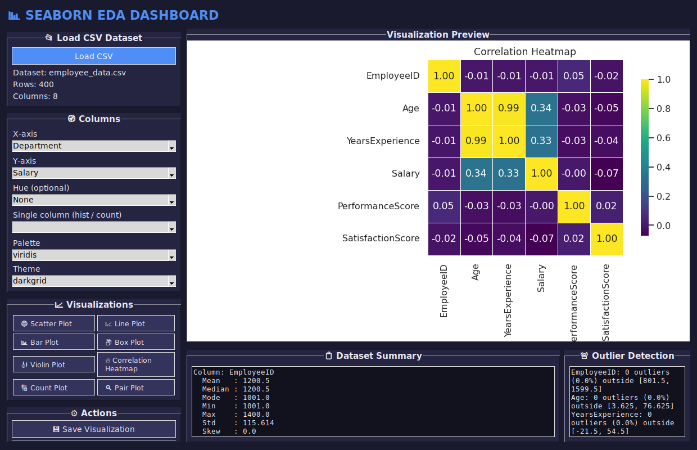
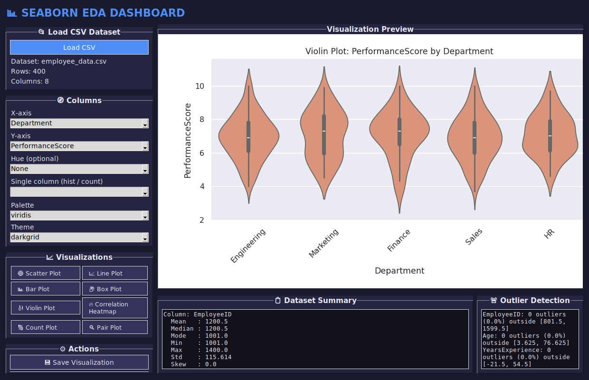

<div align="center">


# 📊 Seaborn EDA Dashboard

A desktop GUI application for exploratory data analysis (EDA) — load any
CSV, generate 8 statistical visualizations, detect outliers, view
correlation and distribution stats, and export a full EDA report, all
without writing a line of code.

**Python · Tkinter · Seaborn · Matplotlib · Pandas · NumPy**

[](https://www.python.org/)
[](LICENSE)
[](https://seaborn.pydata.org/)
[](https://pandas.pydata.org/)

</div>

---

## 📌 Project Overview

This is a follow-up to my [Data Visualization Dashboard](../data-visualization-dashboard)
project, rebuilt around **exploratory data analysis** specifically rather
than generic charting. Instead of just plotting columns, it answers the
questions an analyst actually asks first: *What does this distribution look
like? Are there outliers? How do these variables correlate? Is anything
missing?*

Like the earlier project, it's built with a clean module separation —
`gui.py` (presentation), `plots.py` (seaborn figure builders), `eda.py`
(statistics: summary, correlation, outlier detection, missing values),
`file_handler.py` (I/O), and `customize.py` (styling state) — so each piece
is independently testable and easy to extend.

---

## ✨ Features

| Category | What it does |
|---|---|
| ✅ Load CSV Dataset | File picker → validates and loads any `.csv` into Pandas |
| ✅ Dataset Summary | Mean, median, mode, min, max, std, and skew for every numeric column |
| ✅ Scatter Plot | Relationship between two numeric columns, optional hue grouping |
| ✅ Line Plot | Trend of a numeric column over another, optional hue grouping |
| ✅ Bar Plot | Mean of a numeric column by category, with error bars |
| ✅ Box Plot | Spread and outliers of a numeric column by category |
| ✅ Violin Plot | Full distribution shape of a numeric column by category |
| ✅ Correlation Heatmap | Annotated Pearson correlation matrix across numeric columns |
| ✅ Count Plot | Frequency of categories in any column |
| ✅ Pair Plot | Pairwise scatter + KDE grid across up to 4 numeric columns |
| ✅ Save Visualizations | Export the current chart as a PNG |
| ✅ Generate EDA Report | Export a full text report: stats, outliers, missing values, correlation |

---

## 🖥 Screenshots

<table>
<tr>
<td width="50%"></td>
<td width="50%"></td>
</tr>
<tr>
<td align="center"><sub>Home screen — no dataset loaded yet</sub></td>
<td align="center"><sub>Correlation heatmap with live summary + outlier panels</sub></td>
</tr>
</table>

<p align="center">

<br>
<sub>Violin plot showing performance score distribution by department</sub>
</p>

---

## 🛠 Installation

```bash
# 1. Clone the repository
git clone https://github.com/<your-username>/seaborn-eda-dashboard.git
cd seaborn-eda-dashboard

# 2. (Recommended) create a virtual environment
python -m venv venv
source venv/bin/activate      # Windows: venv\Scripts\activate

# 3. Install dependencies
pip install -r requirements.txt

# 4. Run the app
python main.py
```

**Requirements:** Python 3.9+ with Tkinter available (Tkinter ships with
most standard Python installers; on Linux you may need
`sudo apt install python3-tk`).

---

## 🚀 Quick Start

1. Click **Load CSV** and select a file — try the bundled
   [`data/employee_data.csv`](data/employee_data.csv) (400 rows × 8 columns,
   with intentional outliers and missing values) or
   [`data/flower_measurements.csv`](data/flower_measurements.csv) (150 rows,
   great for the pair plot).
2. Pick **X-axis**, **Y-axis**, and optionally a **Hue** column from the
   dropdowns.
3. Click any visualization button — **Scatter**, **Line**, **Bar**, **Box**,
   **Violin**, **Correlation Heatmap**, **Count**, or **Pair Plot**.
4. Adjust the **Palette** or **Theme** and regenerate to restyle.
5. Check the **Dataset Summary** and **Outlier Detection** panels for
   instant stats, or click **Generate EDA Report** for a full text export.

---

## 📂 Folder Structure

```
seaborn-eda-dashboard/
│
├── main.py                    # Entry point — run this
├── requirements.txt
├── README.md
├── LICENSE
├── .gitignore
│
├── assets/                    # Logo, banner, app icon
│   ├── logo.png
│   ├── banner.png
│   └── icon.ico
│
├── data/                      # Sample datasets to try the app with
│   ├── employee_data.csv
│   └── flower_measurements.csv
│
├── visualizations/            # Example exported chart PNGs
│   ├── scatter_plot.png
│   ├── line_plot.png
│   ├── bar_plot.png
│   ├── box_plot.png
│   ├── violin_plot.png
│   ├── correlation_heatmap.png
│   ├── count_plot.png
│   └── pair_plot.png
│
├── reports/                   # Example generated EDA report
│   └── eda_report.txt
│
├── screenshots/                # README screenshots
│   ├── home.png
│   ├── charts.png
│   └── dashboard.png
│
└── src/                         # Application source
    ├── gui.py                  # Tkinter layout, widgets, event wiring
    ├── plots.py                 # Seaborn/matplotlib figure builders
    ├── file_handler.py          # load_csv / save_visualization / generate_eda_report
    ├── eda.py                   # summary stats, correlation, outliers, missing values
    ├── customize.py              # Chart styling state (palette/theme/context/marker)
    └── utils.py                  # show_message / clear_frame / validate_dataset
```

---

## 📊 Supported Visualizations

| Chart | Best for |
|---|---|
| 🔵 **Scatter Plot** | Relationship between two numeric variables |
| 📈 **Line Plot** | Trends over an ordered axis |
| 📊 **Bar Plot** | Comparing a numeric average across categories |
| 📦 **Box Plot** | Spread, median, and outliers by category |
| 🎻 **Violin Plot** | Full distribution shape by category |
| 🔥 **Correlation Heatmap** | Pairwise correlation across all numeric columns |
| 🔢 **Count Plot** | Frequency of each category |
| 🔍 **Pair Plot** | Pairwise relationships across multiple numeric columns at once |

---

## 📚 Concepts Used

- **Seaborn** — statistical chart types (violin, box, heatmap, pair plot) with theming
- **Matplotlib** — figure embedding via `FigureCanvasTkAgg`, PNG export
- **Pandas** — CSV loading, grouping, correlation matrices
- **NumPy** — numeric summary calculations
- **EDA** — the full exploratory workflow: summary stats → distribution →
  outliers → correlation → missing values
- **Correlation** — Pearson correlation matrix, visualized as an annotated heatmap
- **Distribution** — histogram + KDE overlays, violin plots
- **Outlier Detection** — IQR (1.5× rule) applied per numeric column
- **Statistical Visualization** — mean, median, mode, std, and skew reported
  alongside every chart

---

## 🚀 Future Improvements

- [ ] Add a "distribution" tab with histogram + KDE for any column
- [ ] Support grouped/faceted plots (`FacetGrid`) for multi-panel EDA
- [ ] Export the full EDA report as PDF
- [ ] Add a simple linear regression trendline overlay on scatter plots
- [ ] Dark/light theme toggle for the app UI itself
- [ ] Remember last-used dataset and settings between sessions
- [ ] Unit test suite (pytest) covering `eda.py` and `file_handler.py`

---

## 👩‍💻 Author

Built as a portfolio project demonstrating exploratory data analysis and
statistical visualization in Python — the natural next step after a basic
Matplotlib dashboard, and a stepping stone toward applied machine learning.

Feel free to fork, open issues, or submit a PR.

---

<div align="center">
<sub>Licensed under the <a href="LICENSE">MIT License</a>.</sub>
</div>
